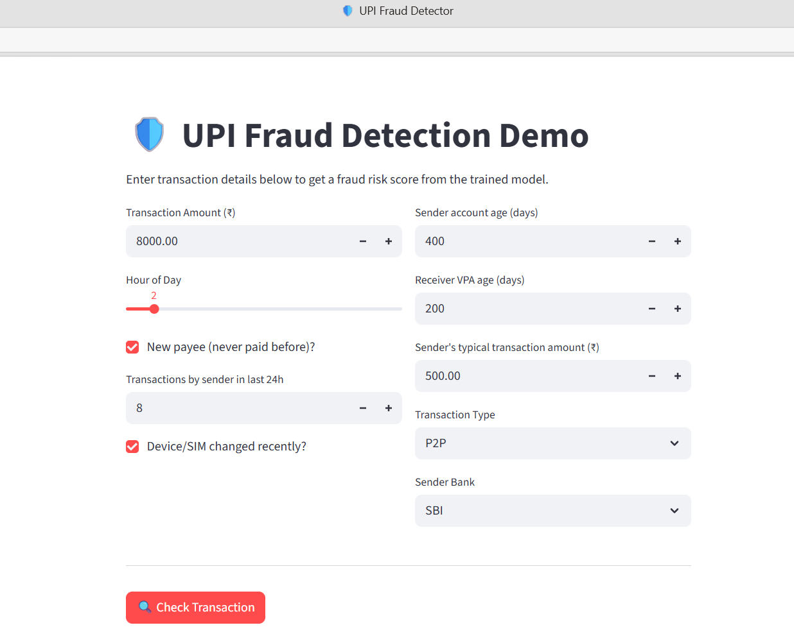
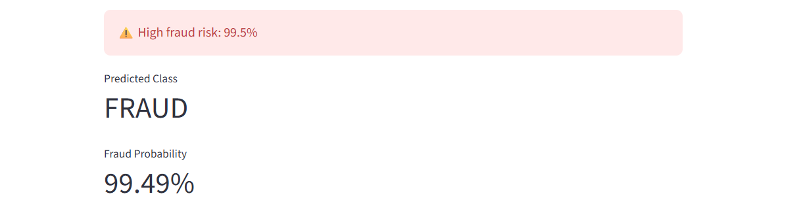

# 🛡️ UPI Fraud Detection System

A Machine Learning project that detects fraudulent UPI transactions using a synthetic dataset and an interactive Streamlit web application. This project demonstrates the complete ML workflow, including data generation, preprocessing, model training, evaluation, and real-time fraud prediction.

## 📌 Project Overview

UPI fraud has become a major concern with the rapid growth of digital payments. Since real UPI transaction datasets are not publicly available due to privacy concerns, this project generates a realistic synthetic dataset that mimics genuine transaction behavior and common fraud patterns.

The trained machine learning model predicts whether a transaction is **Legitimate** or **Fraudulent** and provides a fraud probability score through an interactive Streamlit interface.

## 🚀 Features

- Generate realistic synthetic UPI transaction data
- Simulate common fraud patterns
- Train and compare multiple Machine Learning models
- Handle highly imbalanced fraud data
- Interactive Streamlit web application
- Real-time fraud prediction
- Fraud probability score
- Feature importance visualization
- Precision-Recall Curve comparison
- Model saved for future predictions

## 🛠️ Technologies Used

- Python
- Streamlit
- Pandas
- NumPy
- Scikit-learn
- XGBoost
- Matplotlib
- Joblib

## 📂 Project Structure

UPI-Fraud-Detection-System/
│
├── generate_data.py
├── train.py
├── app.py
├── README.md
│
├── data/
│   ├── upi_transactions.csv
│   ├── pr_curves.png
│   └── feature_importance.png
│
├── models/
│   └── fraud_model.pkl
│
└── screenshots/
    ├── home.png
    └── prediction.png

## 📊 Dataset

The project generates **50,000 synthetic UPI transactions** with approximately **2% fraudulent transactions**.

### Dataset Features

- Transaction Amount
- Hour of Day
- Transaction Type
- Sender Bank
- New Payee Flag
- Transactions in Last 24 Hours
- Device Change
- Sender Account Age
- Receiver VPA Age
- Amount-to-Average Ratio
- Fraud Label

## 🔍 Fraud Patterns Simulated

The synthetic dataset includes realistic fraud behaviors such as:

- High-value transfers to new payees
- Odd-hour transaction bursts
- Mule account fan-in
- Device/SIM takeover attacks

These patterns help train the model on realistic fraud scenarios.

## 🤖 Machine Learning Models

The project compares multiple classification models:

- Logistic Regression
- Random Forest
- XGBoost (Optional)

The best-performing model is automatically selected and saved for deployment.

## 📈 Model Evaluation

Instead of relying only on Accuracy, the models are evaluated using:

- Precision
- Recall
- F1 Score
- Confusion Matrix
- ROC-AUC
- Precision-Recall AUC (Primary Metric)

Since fraud detection is an imbalanced classification problem, Precision-Recall AUC provides a more reliable performance measure than Accuracy.

## ⚙️ Installation

Clone the repository
git clone https://github.com/yourusername/UPI-Fraud-Detection-System.git
Move into the project directory
cd UPI-Fraud-Detection-System
Install dependencies
pip install pandas numpy scikit-learn matplotlib streamlit joblib xgboost

## ▶️ Run the Project

### Step 1: Generate Dataset

python generate_data.py

### Step 2: Train the Model

python train.py

### Step 3: Launch the Streamlit App

streamlit run app.py

## 💻 Application Workflow

1. Generate synthetic UPI transaction data.
2. Train Machine Learning models.
3. Compare model performance.
4. Save the best-performing model.
5. Launch the Streamlit application.
6. Enter transaction details.
7. Receive fraud prediction and probability score.

## 📸 Screenshots

### Home Page

### Prediction Result

## 📌 Future Enhancements

- Real UPI transaction dataset integration
- Deep Learning models
- Graph-based fraud detection
- SHAP Explainable AI
- Email/SMS fraud alerts
- Live API integration
- Cloud deployment
- User authentication

---

## ⚠️ Disclaimer

This project is developed for educational and learning purposes only.

The dataset is synthetically generated because real UPI transaction data is confidential and not publicly available.

This application should not be used for real-world financial decision-making.

---

## 👩‍💻 Author

**Manasvi Mangesh Kadam**

Final Year B.Sc. Information Technology Student

Aspiring Data Scientist | Machine Learning Enthusiast

### Connect with me

**LinkedIn:**  
https://www.linkedin.com/in/manasvi-kadam-228597282

**GitHub:**  
https://github.com/manasvi25325
